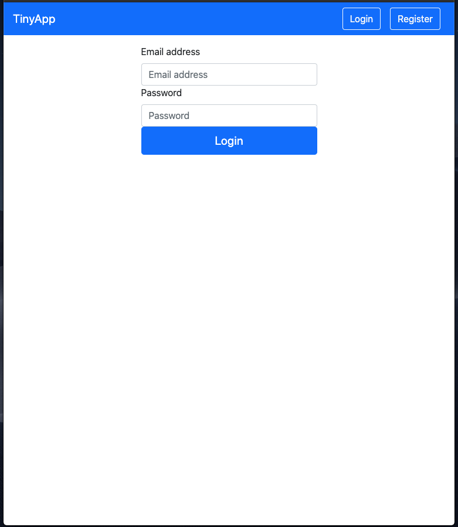
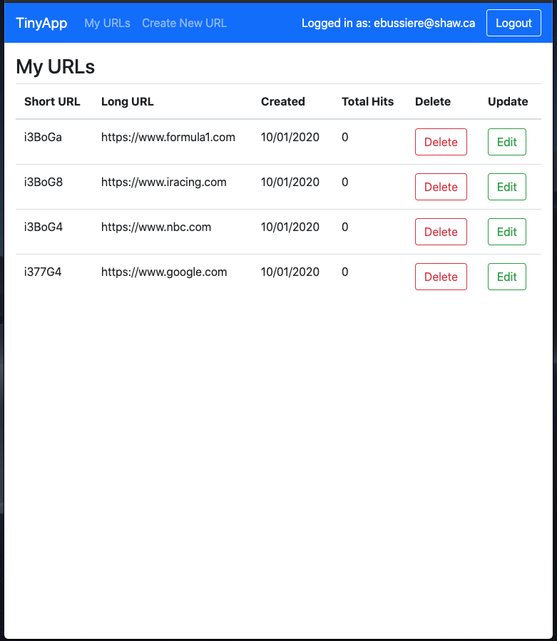
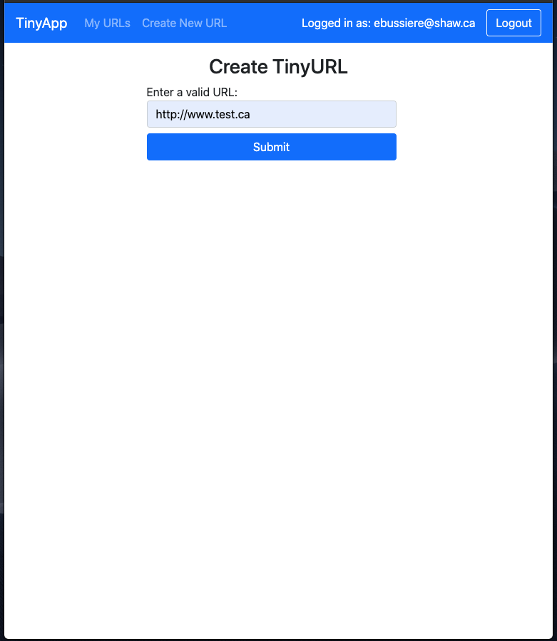
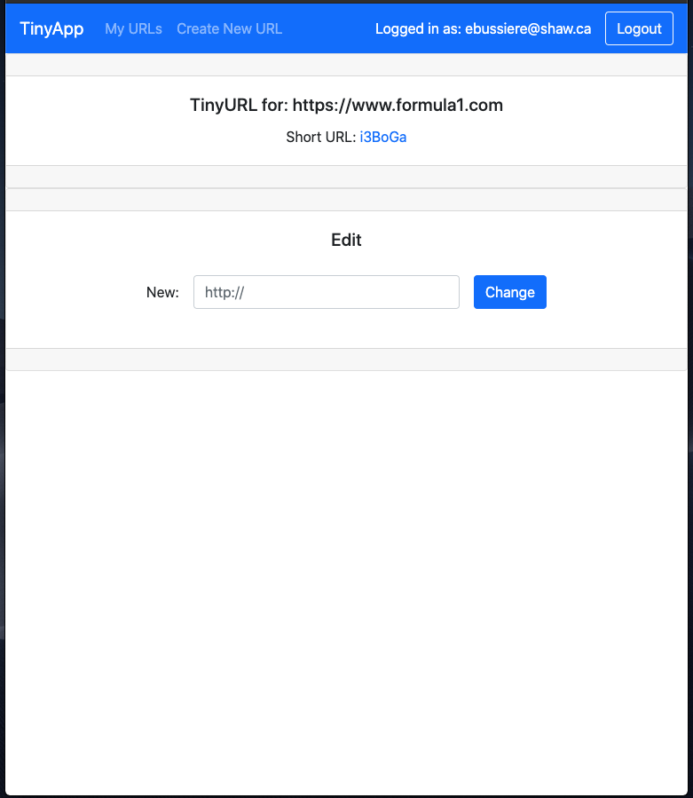

# TinyApp Project
## What does it do?
TinyApp is a full stack web application built with Node and Express that allows users to shorten long URLs (à la bit.ly).

## Login/Register

* Login with valid credentials or register as a new user 



## Index
* Displaye a list of the logged in user's shortend urls.
* Displays some basic analytics for each entry (see TODOs)
* The logged in use can edit the target of each entry or delete an entry if no longer required.
* A form for adding new shortened URLs can be accessed via the "Create New URL" item in the navigation bar.
### TODO
* Add analytics to indicate unique users for each tiny URL followed  


## Create New Tiny URL
* Used to create additional shortened URLs
* User redirected to Index after successfuly creating a new link 
### TODO
* Target URL validation is currently handled by the HTML of the page. Would like to validate using the back end.   



## Edit
* Used to edit the target of any existing Tiny URL
* User redirected to Index after successfuly editing an itemnk 
### TODO
* Target URL validation is currently handled by the HTML of the page. Would like to validate using the back end.



## Dependencies
- Moment.js
- Node.js
- Express
- EJS
- bcrypt
- body-parser
- cookie-session

## Getting Started

- Install all dependencies listed above
```bash
npm install
```
- Run the development web server 
```bash
node express_server.js
```
or to run using nodemon
```bash
npm start
```
To run using nodemon

App runs at: http://localhost:8080/urls
Shortened URLS can be used by visiting "http://localhost:8080/u/[shorturl]" in another browser tab/window.

## TODO

1. Use .env file. 
1. Combine auth routes 
2. Provide code comments for future developers/maintenance. 
3. Publish to Azure.

